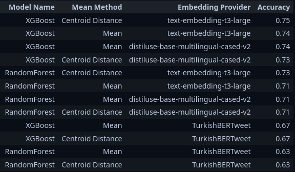

# Machine Learning (CS 412) Term Project

Sabanci University, 2024-2025 Fall.  
Machine Learning (CS 412) Course Term Project.

## Team Members

- Tasnylu Akhmetova ([@tansylu](https://github.com/tansylu))
- Egi Cekici ([@egi-c](https://github.com/egi-c))
- Tugrul Agrikli ([@tagrikli](https://github.com/Tagrikli))

---

> It was nice to work with you all. It was quite a long and tiring journey, but it is finally over and we can rest now. Thank you very much for all of your contributions, as well as your supportive and friendly attitudes. I might not have come this far without your help. `Tugrul`

# Project Goal

This machine learning project addresses classification and regression tasks in Instagram data analysis, utilizing a dataset of 5,415 Instagram accounts, including detailed account profiles and metrics from 35 posts per account.

Both models will undergo a three-round evaluation process, where performance is tested against different test datasets provided sequentially by the lecturer. This multi-round testing approach ensures the robustness of the models against varying data distributions and helps validate their generalization capabilities.

The project leverages the rich feature set available in the dataset, including account biographical information, follower metrics, and historical post data, to create robust and accurate prediction models. The project allows for exploration and comparison of different machine learning algorithms to determine the most effective approach for each task.

# Regression

The regression task focuses on predicting the like count for individual Instagram posts, using both account characteristics and post-specific information. The model implementation uses separate training paths for verified and non-verified accounts to better handle the distinct engagement patterns of these user types.

## Dataset Processing and Feature Engineering

### Data Cleaning Steps
1. Removed unnecessary columns (timestamp, username, category_name)
2. Dropped median-based features to reduce redundancy
3. Encoded binary categorical features
4. Applied outlier detection and imputation
5. Split data into verified and non-verified sets

### Feature Engineering

1. **Binary Features**
   - is_verified
   - is_business_account
   - is_holiday
   - is_professional_account
   - is_lottery
   - media_type_VIDEO

2. **Engineered Ratios**
   - mean_max_likes_ratio: mean_likes / max_likes
   - comments_per_follower: comments_count / follower_count
   - t_1_to_mean_likes: t_1_likes / mean_likes
   - t_1_to_follower: t_1_likes / follower_count
   - comment_to_post: comments_count / post_count
   - t_1_t_2: Interaction between consecutive post likes

3. **Statistical Features**
   - Historical engagement metrics
   - Account-level statistics
   - Temporal sequence features (t_1 through t_33)

### Outlier Management

Implemented IQR-based outlier imputation with:
- 1st and 99th percentile boundaries
- 1.5 IQR multiplier
- Separate handling for verified and non-verified accounts
- Option to toggle outlier imputation

## Model Development

### Data Split Strategy
- Separate models for verified and non-verified accounts
- 76%-24% train-test split
- Random state 15 for reproducibility

### Model Selection and Optimization

Used XGBoost with Optuna hyperparameter optimization:
- Learning rate range: 0.01 to 0.3
- Max depth range: 3 to 10
- N estimators range: 100 to 500
- Subsample range: 0.6 to 1.0
- Optimization metric: MAE
- Additional regularization parameters (alpha and lambda)

### Implementation Details

1. **Base Configuration**
   - Objective: reg:gamma
   - Evaluation metric: MAE
   - Seed: 8
   - Non-negative prediction enforcement

2. **Hyperparameter Tuning**
   - 10 optimization trials per model
   - Separate optimization for verified/non-verified models
   - Early stopping on validation set

3. **Model Persistence**
   - Saved separate models for verified and non-verified users
   - Stored predictions for analysis
   - Feature importance tracking

## Performance Analysis

The model's performance is tracked separately for verified and non-verified accounts:
- Train and Test MAE for each user category
- Feature importance rankings
- Prediction distribution analysis

## Implementation Highlights

1. **Dual-Path Training**
   - Separate optimization for different account types
   - Custom feature importance analysis per model
   - Independent prediction paths

2. **Robust Processing**
   - Configurable outlier handling
   - Comprehensive feature engineering
   - Scalable prediction pipeline

3. **Output Generation**
   - CSV files for predictions
   - Serialized model storage
   - Detailed performance metrics

## Model Usage

The implementation provides:
- Separate model files for verified/non-verified prediction
- Feature preprocessing pipelines
- Prediction post-processing functions
- Performance analysis tools

# Classification

The classification task aims to develop a model that can accurately categorize Instagram accounts into 10 distinct categories: entertainment, food, travel, health and lifestyle, mom and children, fashion, tech, sports, art, and gaming. This model will be trained on a labeled subset of 2,743 accounts and evaluated using accuracy metrics.

## Dataset Cleaning and Preparation

The project began with `train-classification.csv`, which contained paired `username` and `category` data for model training. The `training-dataset.jsonl` dataset included data for both classification and regression data, with each row containing profile and post information for a single account.

### Data Processing Steps:
1. Cleaned and processed categories
2. Removed rows containing null values
3. Normalized JSON values in relevant fields
4. Evaluated each field's predictive power using various metrics

We analyzed the data distribution to check for class imbalance. While some imbalance was present, it wasn't significant enough to warrant rebalancing, especially since accuracy was our primary evaluation metric.

### Field Selection
The profile data contained numerous fields, including:
- Potentionally predictive fields such as `biography`, `is_verified`, etc.
- Instagram identification fields such as `fbid` (removed as irrelevant to classification)

We conducted chi-square tests and calculated Cramer's V values to assess field independence. Based on this evaluation, we eliminated most of the fields and fields left were:
- From profile information: `biography` and `category_enum`
- From post information: `caption`

### Final Datasets
We generated two distinct datasets for ease of use:
1. Account Information Dataset
   - Fields: `username`, `biography`, `category_enum`
2. Post Information Dataset
   - Fields: `username`, `caption`

## Text Processing

Given our classification goal relied on textual data, we needed to convert text into numerical representations. After team discussion, we determined that traditional methods like "Bag of Words" or "TF-IDF" would be insufficient for our needs. Instead, we opted for a neural network-based approach to create text embeddings.

### Embedding Models Used

1. **TurkishBERTweet**
   - Developed by Onur Varol ([@onurvarol](https://github.com/onurvarol))
   - Published in ["TurkishBERTweet: Fast and Reliable Large Language Model for Social Media Analysis"](https://arxiv.org/abs/2311.18063)
   - Chosen for its pre-training on Turkish social media text
   - We extracted CLS embeddings from the model output

2. **SentenceTransformers**
   - Used the `distiluse-base-multilingual-cased-v2` model
   - Accessed via the [SentenceTransformers](https://www.sbert.net/index.html) Python package
   - Selected for its multilingual semantic similarity capabilities

3. **OpenAI's text-embedding-3-large**
   - Processing time: approximately 9 hours for batch requests
   - Source: [OpenAI Embeddings Documentation](https://platform.openai.com/docs/guides/embeddings)

## Embedding Processing

We explored two approaches to combine the embeddings from biographies and post captions:

1. **Mean-based Approach**
   - Calculated the mean of all post caption embeddings
   - Combined with biography embedding using weighted averaging

2. **Centroid-based Approach**
   - Calculated a centroid from all post embeddings
   - Applied weighted averaging based on similarity to the mean
   - Reduced influence of outlier posts

Final Implementation:
- Combined caption and biography embeddings
- Weights: 90% caption, 10% biography
- Prioritized biography information in the final representation

## Model Training

We evaluated several machine learning models:
1. CatBoost
2. k-Nearest Neighbors (k-NN)
3. LightGBM
4. Random Forest
5. XGBoost

### Results
While complete accuracy metrics weren't preserved for all models, we retained results for XGBoost and Random Forest models for each model and settings.

.

The best performing configuration was:
- Model: XGBoost
- Embedding Method: Centroid Distance
- Embedding Source: OpenAI's text-embedding-3-large

This configuration was selected for classifying the test dataset.